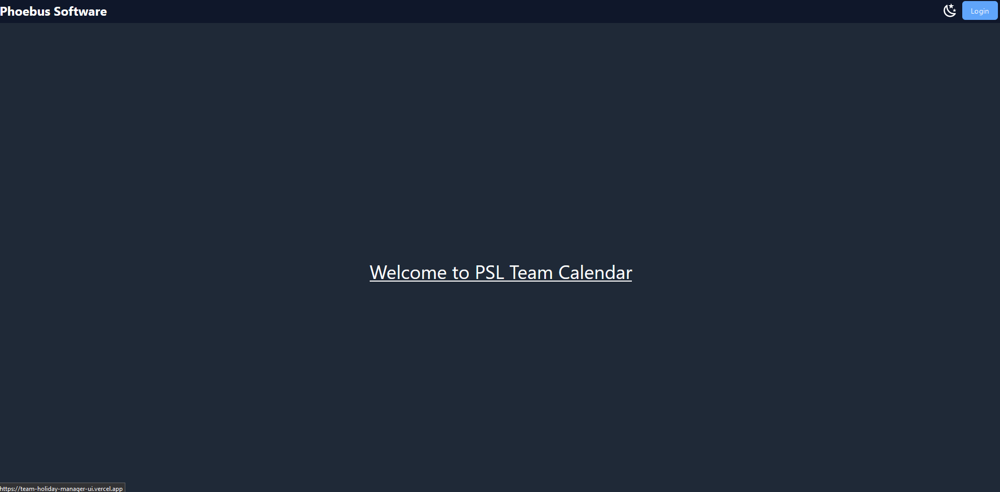

# Front-end to Team Holiday Manager

This is the front-end to the Team Holiday Manager application. It enables users to view and manage their holiday requests.
In addition to the core functionality, it also allows users to manage their profile and view their holiday history.
With the exception of the Teams page, all pages are protected by authentication allowing only SuperAdmins to create teams.

The application is deployed via Vercel and can be accessed at the following link:
[Live Demo](https://team-holiday-manager-ui.vercel.app/)



## Technologies Used

- Svelte
- Typescript
- Tailwind CSS
- Vercel

## Getting Started

To get started, clone this repository and run the following commands:

```bash
cd team-holiday-manager-ui
npm install
```

## Running the application (if back-end is already running)

To run the application locally ensure the back-end is running locally also via Docker or through an venv on an IDE, run the following command:

```bash
npm run dev
```

This will start the application on port 5173. You can then access the application at http://localhost:5173/.

## Running the application with the back-end in docker

To run the application with the back-end in Docker, you will need to run the back-end in Docker.
Instructions for doing this can be found in the [TeamHolidayManager](https://github.com/MinyMinz/TeamHolidayManager) repository.

Once the back-end is running, you can run the front-end with the following command:

```bash
npm run dev
```

This will start the application on port 5173. You can then access the application at http://localhost:5173/.
